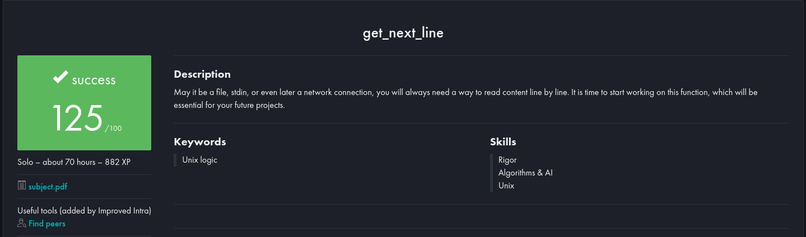

# 42 - Get Next Line

)

## About

> Create a code that reads a file descriptor and returns a line 

These are the files I created as a way of solving the get_next_line exercise from 42.

## Evaluation

### Testing

- [WaRtr0/francinette-image](https://github.com/WaRtr0/francinette-image)
- [Tripouille/gnlTester](https://github.com/Tripouille/gnlTester)
- [kodpe/gnl-station-tester](https://github.com/kodpe/gnl-station-tester)

*Don't copy. Learn It*